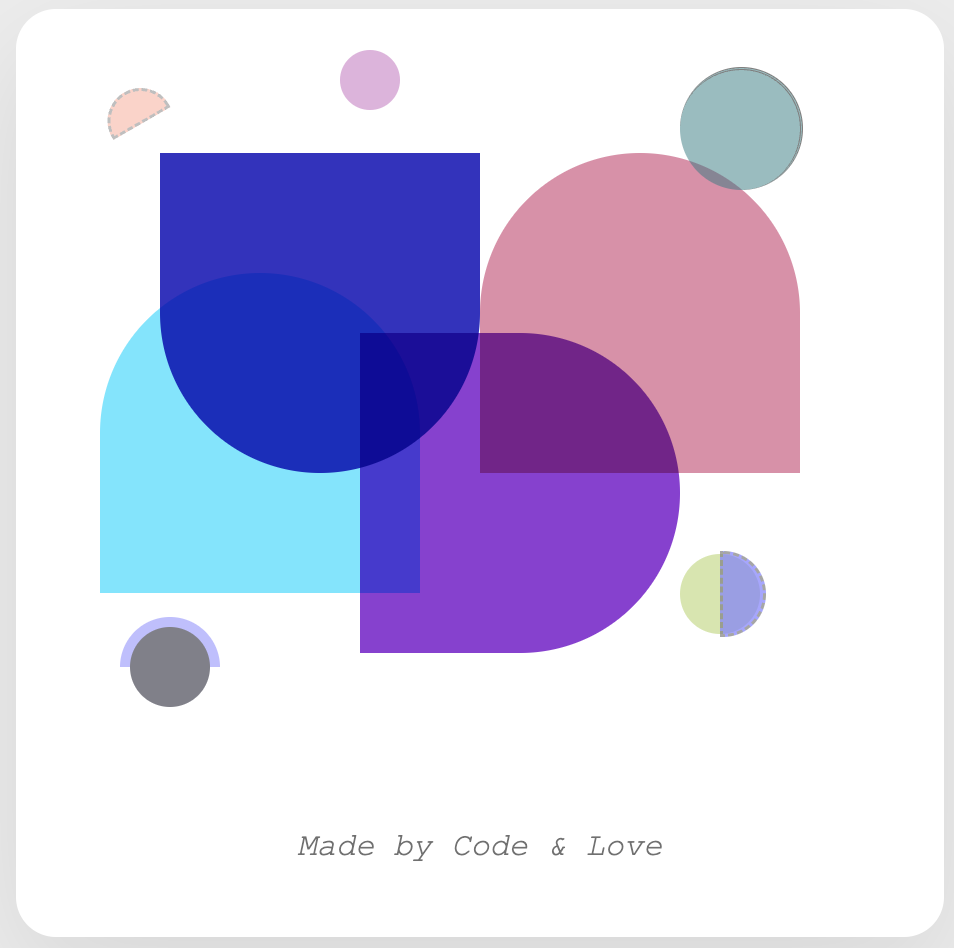

# Poster by Sarvin — "Made with Code & Love"

A creative poster designed using only HTML and CSS, combining the elegance of CSS Grid, Flexbox, and handcrafted shapes to form a playful, artistic layout.

This project explores visual expression through code — where each element is carefully placed, colored, and animated to create balance, contrast, and rhythm.

---

## Features

- Custom layout with CSS Grid for structured composition
- Shapes built from scratch with border-radius and transform
- Overlapping elements using position: absolute for abstract design
- Fully responsive and centered using flex and media queries
- Smooth hover transitions and blend modes for artistic effect

---

## Preview

"Color is the music of the eyes..."  
Designed with care, code and creativity.



---

## Technologies

- HTML5  
- CSS3 (Flexbox, Grid, Transforms, Blend Modes)  
- No JavaScript — pure CSS

---

## How to use

1. Clone the repo:
   ```bash
   https://github.com/SarvinInCode/css-poster-showcase.git
